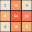

# Привет, меня зовут Олег!

---

### 🚀 Проекты:

  
  

---

### :man_technologist: Обо мне:

Я начинающий Frontend разработчик.  
Проходил стажировку в “IT edition” в конце 2022 года и разрабатывал внутренний сервис для организации информации и задач. 

В 2023 нашел ментора, который помог мне со структуризацией информации (так как её было довольно много). Прохожу курсы на платформе udemi, параллельно прорабатывая все непонятные моменты с ментором. 
А вообще мой путь в IT начался в 2016 году. Работал системным администратором (asterisk/linux/docker(немного)/winServer2007-2016). После определенного времени проведенного в данной сфере мне начала нравится frontend разработка. 

В настоящий момент нахожусь в поиске работы, параллельно изучая фреймворк react и различные библиотеки JS для анимаций.

### :seedling: Завершил несколько курсов по веб-разработке!
- [Anton Larichev](https://www.udemy.com/course/react-nextjs) - in progress
- [Stepik](https://stepik.org/course/38218/promo#toc?auth=login) - completed
- [Ivan Petrichenko](https://www.udemy.com/course/javascript_full) - completed
- [Bogdan Stashchuk](https://www.udemy.com/course/javascript-ru) - completed
- [Rob Percival](https://www.udemy.com/course/the-complete-web-developer-course-2-russian) - completed
- [Denis Astahov](https://www.udemy.com/course/linux-lpi) - completed

### :zap: Имею опыт в сфере ИТ больше 7 лет. Из них 1.5 года в сфере веб-разработки.

#### :mailbox: Как связаться со мной:  

---

### 🤝 Социальные сети:

  

    
    
  

---

### 💻 Технологии:

  &nbsp
  &nbsp
  &nbsp
  &nbsp
  &nbsp
  &nbsp
  &nbsp;
  &nbsp;
  &nbsp;

---

### 🛠 Инструменты:

  &nbsp;
  &nbsp;
  &nbsp;
  &nbsp;
  &nbsp;
  &nbsp;

### 🎯 Codewars:

### ⚙️ GitHub статистика:

<table>
  <tr>
    <td>
      
    </td>
    <td>
      
    </td>
  </tr>
</table>

### 🛠 Разбор различных задач Codewars по уровням:
- [4 kyu](https://github.com/ShaliukovOleg/CodeWars-4-kyu-Solution-Explanation)
- [5 kyu](https://github.com/ShaliukovOleg/CodeWars-5-kyu-Solution-Explanation)
- [6 kyu](https://github.com/ShaliukovOleg/CodeWars-6-kyu-Solution-Explanation)
- [7 kyu](https://github.com/ShaliukovOleg/CodeWars-7-kyu-Solution-Explanation)
- [8 kyu](https://github.com/ShaliukovOleg/CodeWars-8-kyu-Solution-Explanation)
